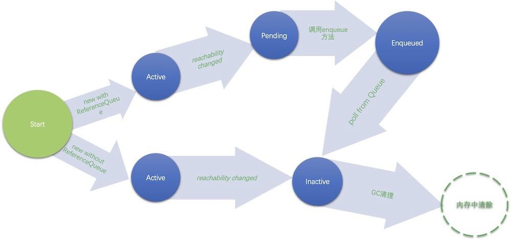

# Reference Type

## Strong Reference

- Any object which has an active strong reference are **not eligible for garbage collection**. The object is garbage collected only when the variable which was strongly referenced points to `null`.
    
    ```java
    public class StrongReferenceUsage {
    
        @Test
        public void stringReference(){
    				//obj is strong reference
            Object obj = new Object();
        }
    }
    ```
    

## Soft Reference

- The objects gets cleared from the memory when **JVM runs out of memory**.
    
    ```java
    @Test
        public void softReference(){
            Object obj = new Object();
            SoftReference<Object> soft = new SoftReference<>(obj);
            obj = null;
            log.info("{}",soft.get());
            System.gc();
            log.info("{}",soft.get());
        }
    ```
    
    ```java
    22:50:43.733 [main] INFO com.flydean.SoftReferenceUsage - java.lang.Object@71bc1ae4
    22:50:43.749 [main] INFO com.flydean.SoftReferenceUsage - java.lang.Object@71bc1ae4
    ```
    
- Two constructors
    
    ```java
    public SoftReference(T referent)
    public SoftReference(T referent, ReferenceQueue<? super T> q)
    ```
    

## Weak Reference

- If JVM detects an object with only weak references, this object will be **marked for garbage collection.**
    
    ```java
    		@Test
        public void weakReference() throws InterruptedException {
            Object obj = new Object();
            WeakReference<Object> weak = new WeakReference<>(obj);
            obj = null;
            log.info("{}",weak.get());
            System.gc();
            log.info("{}",weak.get());
        }
    ```
    
    ```java
    22:58:02.019 [main] INFO com.flydean.WeakReferenceUsage - java.lang.Object@71bc1ae4
    22:58:02.047 [main] INFO com.flydean.WeakReferenceUsage - null
    ```
    
- Two constructors
    
    ```java
    public WeakReference(T referent)；
    public WeakReference(T referent, ReferenceQueue<? super T> q)；
    ```
    

## Phantom Reference

- The objects are **eligible for garbage collection**, but before removing them from the memory, JVM puts them in a queue called `ReferenceQueue`.
    
    ```java
    @Slf4j
    public class PhantomReferenceUsage {
    
        @Test
        public void usePhantomReference(){
            ReferenceQueue<Object> rq = new ReferenceQueue<>();
            Object obj = new Object();
            PhantomReference<Object> phantomReference = new PhantomReference<>(obj,rq);
            obj = null;
            log.info("{}",phantomReference.get());
            System.gc();
            Reference<Object> r = (Reference<Object>)rq.poll();
            log.info("{}",r);
        }
    }
    ```
    
    ```java
    07:06:46.336 [main] INFO com.flydean.PhantomReferenceUsage - null
    07:06:46.353 [main] INFO com.flydean.PhantomReferenceUsage - java.lang.ref.PhantomReference@136432db
    ```
    

## Reference Status



- For Reference with `ReferenceQueue`, GC will put the Reference of the object to be recycled into ReferenceQueue, and the Reference needs to be **handled by the programmer**(call the `poll` method).
- Reference without ReferenceQueue is **handled by GC** itself, and when the object state changes, the Reference state of the object to be recycled will become Inactive.