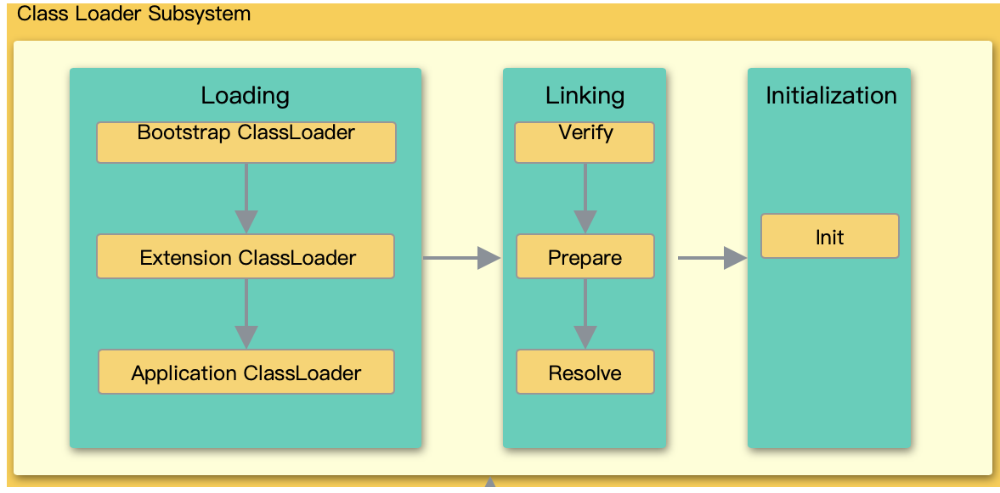
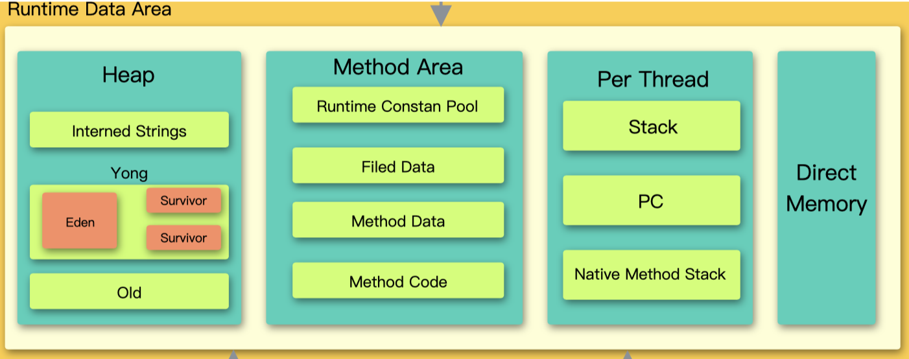
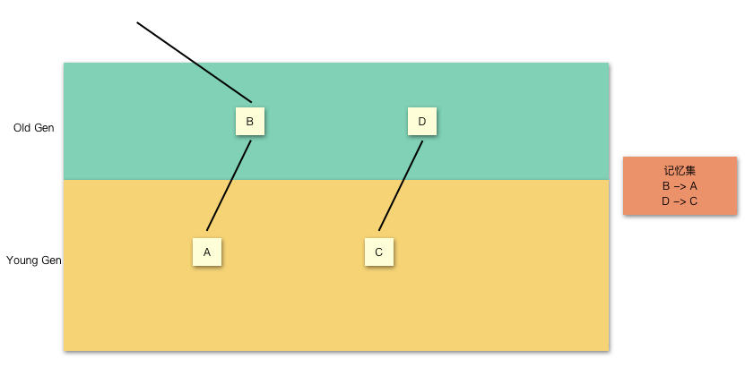

# JVM

## Compiler

Java source program is compiled to java `bytecode` and **JVM** will explain and execute it. 

**Multiple platform**: `Bytecode` compiled from one system can be explained and executed on another system.

## Thread

- **Daemon threads**: Usually used by **virtual machines**, such as GC threads. Java programs can mark any thread they create as daemon.
- **Non-daemon thread**: The thread executed by the main method, which is often referred to the **user thread**.

## Class Loader

> Responsible for dynamically **loading Java classes** into the **memory** of the JVM. Classes are usually loaded when they are used for the **first time**.
> 

1. **Loading**: Find and load the type of binary data.
2. **Link**: Perform validation, preparation and parsing (optional) 
    - **Verification**: Ensure the correctness of the imported class.
    - **Prepare**: Allocate memory for class variables and initialize them as default values.
    - **Resolve**: Convert symbolic references to direct references.
3. **Initialization**: Initialize the class variable to the correct initial value.

<aside>
💡 全盘负责双亲委托机制: Organize different ClassLoaders.

全盘负责: When a ClassLoader loads a class, unless another ClassLoader is explicitly used, the dependent and referenced class is also loaded by the ClassLoader.

双亲委托: Find the target class first in parent loader, if it cannot be found, then find and load the target class from its own class path.

</aside>

## Runtime Data Area

## Garbage Collection

### Object Survival Detection

- **Reference counting**
    
    Add a reference counter to each object, add 1 when it is referenced and subtract 1 when the reference is gone. When two objects refer to each other, neither of them can be recycled.
    
- **Root Search**
    
    Track the reference diagram starting from the root node. When a node has no path to reach, it is a recyclable object.
    

### Garbage Collection Algorithm

- **Replication and Recycling**
    
    Divide the available memory into **two equal sizes**, and only one of them is used. When this memory is used up, copy the surviving object to the other memory, and then empty the memory on this memory.
    
    It effectively **avoids memory fragmentation**, but r**educe memory usage**.
    
- **Mark and Clear**
    
    **Pause** all running threads and the **recycling thread** scan and clean up directly. After the recycling is completed, the running thread will be restored. 
    
    A large number of **discontinuous memory fragments** will be generated, resulting in a waste of space.
    
- **Mark and Organization**
    
    Similar to Mark and Clear, but retained objects will be **moved and collected** into **continuous** memory space, thus integrating free space.
    
- **Incremental Recovery**
    
    Divide the memory space into **several regions**. The objects required for the program to run will be distributed in these regions, and only **one** of them will be **recycled** at a time. 
    
    **Reducing the recovery** time and increasing the response speed of the program.
    
- **Generation Recycling**
    
    
    
    **Young GC**: It’s costly to traverse Old Gen to determine whether C is referenced outside. Therefore, a **Remembered Set** records the reference from Old Gen To Young Gen and use the Old Gen in the set as the GC Root to build **reference diagrams**.
    

## Class Instantiation

1. `new`
2. `newInstance()`
3. `clone`
4. `java.io.ObjectInputStream.getObject()`Deserialization