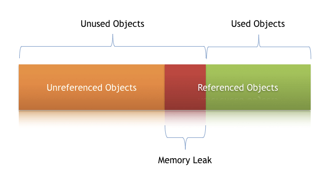

# Memory Leak

## What is a Memory Leak

There are **unused objects** present in the heap, but the garbage collector is **unable to remove** them from memory because they are still being **referenced.**

A memory leak is bad because it **blocks memory resources** and **degrades system performance** over time. **T**he application will eventually **exhaust its resources**, finally terminating with a fatal `java.lang.OutOfMemoryError`.
.



## Types

### Static Fields

> Have a life that usually matches the **entire lifetime** of the running **application**.
> 

```java
public class StaticTest {
    public static List<Double> list = new ArrayList<>();

    public void populateList() {
        for (int i = 0; i < 10000000; i++) {
            list.add(Math.random());
        }
        Log.info("Debug Point 2");
    }

    public static void main(String[] args) {
        Log.info("Debug Point 1");
        new StaticTest().populateList();
				// the heap memory isn't yet garbage collected
				// delete static: all the memory of the list is garbage collected because we don't have any reference to it.
        Log.info("Debug Point 3");
    }
}
```

### Unclosed Resources

Whenever we make a new **connection** or open a **stream**, the JVM allocates memory for these resources. e.g. database connections, input streams, and session objects.

Forgetting to close these resources can block the memory, thus keeping them out of the reach of the GC. The **open connection left** from the resources **consumes memory.**

**How to Prevent It?**

- Always use `finally` block to close resources.
- The code that closes the resources **shouldn't have any exceptions** itself.

### Improper *equals()* and *hashCode()* Implementations

Since we haven't defined the proper `equals()` method, the duplicate objects pile up and **increase the memory**.

```java
public class Person {
    public String name;
    
    public Person(String name) {
        this.name = name;
    }
}

@Test
public void givenMap_whenEqualsAndHashCodeNotOverridden_thenMemoryLeak() {
    Map<Person, Integer> map = new HashMap<>();
    for(int i=0; i<100; i++) {
        map.put(new Person("jon"), 1);
    }
    Assert.assertFalse(map.size() == 1);
}
```

If we'd overridden the `equals()` and `hashCode()` methods properly, then only one `Person` object would exist in this `Map`.

```java
public class Person {
    public String name;
    
    public Person(String name) {
        this.name = name;
    }
    
    @Override
    public boolean equals(Object o) {
        if (o == this) return true;
        if (!(o instanceof Person)) {
            return false;
        }
        Person person = (Person) o;
        return person.name.equals(name);
    }
    
    @Override
    public int hashCode() {
        int result = 17;
        result = 31 * result + name.hashCode();
        return result;
    }
}
```

### *finalize()* Methods

Whenever a class' `finalize()` method is overridden, then objects of that class **aren't instantly garbage collected**. Instead, the **GC queues** them for finalization.

E.g. The overridden `finalize()` method takes a little bit of **time to execute**. When **a large number** of objects of this class get garbage collected, our application will possibly meet an `OutOfMemoryError`.

### Use *ThreadLocals*

> `TheadLocal`:  *S*tore data that will be **accessible only** by **a specific thread**.
> 

```java
ThreadLocal<Integer> threadLocalValue = new ThreadLocal<>();
threadLocalValue.set(1);
Integer result = threadLocalValue.get();
threadLocal.remove();
```

`ThreadLocals` are supposed to be **garbage collected** once the **holding thread** is **no longer alive**. But the problem arises when **Thread Pools** in application servers work on the concept of thread **reuse**, they're never garbage collected; instead, they're reused to serve another request.

If any class creates a `ThreadLocal` **variable, but **doesn't explicitly remove** it, then a copy of that object will **remain** with the worker Thread even after the web **application is stopped**, thus preventing the object from being garbage collected.
